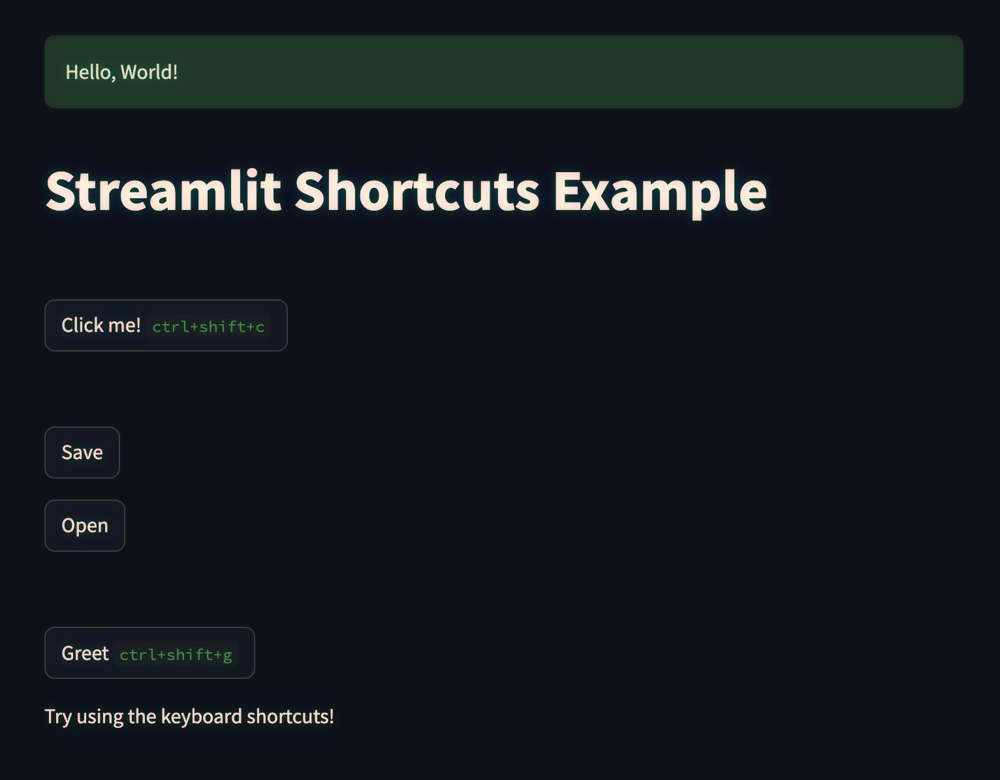

# Streamlit Shortcuts

Streamlit Shortcuts allows you to easily add keyboard shortcuts to your Streamlit buttons.

[Live demo](https://shortcuts.streamlit.app/) <- [`example.py`](./example.py)


 _triggering function with a keyboard shortcut_.


⭐ New in v0.3.0

:pray: Special thanks to @jcbize for PR #26

- Added support for custom target elements and actions - shortcuts can now focus input fields, select text, etc. (not just click buttons). [See example](./example.py)
- Fixed bugs in example code 
- Improved error handling when elements are not found

Previous release: v0.2.0

:pray: Special thanks to @sammlapp for his work and how patient he was during the /pull/18 discussion

- Improved specificity of shortcuts to their respective buttons using st-key selectors
- Bumped to Streamlit 1.45.0

## Installation

```bash
pip install streamlit-shortcuts
```

## Example

Check out the `example.py` file in the repository for a complete working example. Here's a different snippet:

```python
import streamlit as st
from streamlit_shortcuts import button, add_keyboard_shortcuts

def greet(name):
    st.success(f"Hello, {name}!")

button("Greet", "ctrl+shift+g", greet, hint=True, args=("World",))

```

To run the example, clone the repository and execute:

```bash
streamlit run example.py
```

This will launch a Streamlit app demonstrating various ways to use streamlit-shortcuts.

Extra: define shortcut function with a lambda:

```python
if button("Click me!", "ctrl+shift+c", lambda: st.success("Button clicked!"), hint=True):
    st.write("Button was clicked") 
```

## Keys
- Modifiers: 'Ctrl', 'Shift', 'Alt', 'Meta' ('Cmd' on Mac or 'Win' on Windows, thanks to @toolittlecakes)  
- Common Keys: 'Enter', 'Escape', 'Space'
- Arrow Keys: 'ArrowLeft', 'ArrowRight', 'ArrowUp', 'ArrowDown'

Examples of Key Combinations:
- 'Ctrl+Enter'
- 'Shift+ArrowUp'
- 'Alt+Space'

For a complete list of key values, refer to:
https://developer.mozilla.org/en-US/docs/Web/API/KeyboardEvent/key/Key_Values


## Versioning

We use semantic versioning. The current version is stored in the `VERSION` file in the root of the repository.

## Contributing

Contributions are welcome! If you have suggestions for improvements or bug fixes, please follow these steps:

1. Fork the repository
2. Create a new branch for your feature or bugfix
3. Make your changes
4. Add or update tests as necessary
5. Update the `VERSION` file if your changes warrant a version bump
6. Submit a pull request

Please make sure to update tests as appropriate and adhere to the existing coding style.

## Releasing New Versions

To release a new version:

1. Update the `VERSION` file with the new version number
2. Commit the change: `git commit -am "Bump version to X.Y.Z"`
3. Create a new tag: `git tag vX.Y.Z`
4. Push the changes and the tag: `git push && git push --tags`

The GitHub Actions workflow will automatically create a new release and publish to PyPI.

## Contributors
- @toolittlecakes
    - Added 'Meta' modifier
- @quantum-ernest
    - Improved usage ergonomics
    - Keyboard hints
- @taylor-ennen
    - Fixed usage `flow` of code
- @sammlapp
    - Improved specificity of shortcuts to unique elements
    - add flexibility to select different elements and perform different actions
- @jcbize
    - Fixed example code and improved error handling for missing elements
    - Added custom target element and action support (e.g., focusing input fields)

## Credits
Solution inspired by:
- https://github.com/streamlit/streamlit/issues/1291
- https://gist.github.com/brunomsantiago/e0ab366fc0dbc092c1a5946b30caa9a0

Special thanks to @brunomsantiago and @TomJohnH for their initial work on this concept.

Wrapped and extended for easier usage by the Streamlit Shortcuts team.
