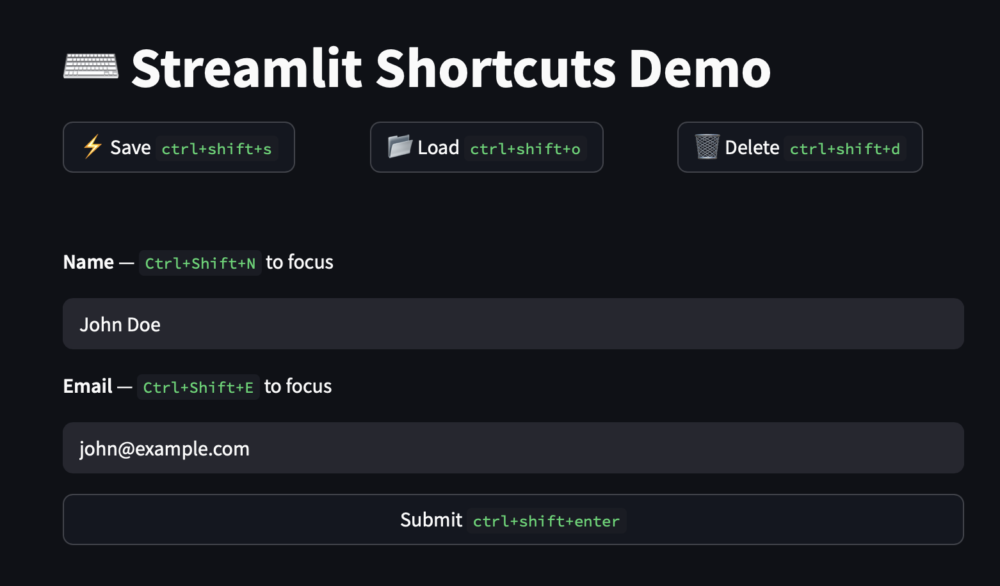

# Streamlit Shortcuts

[](https://pypi.org/project/streamlit-shortcuts/)
[](https://pepy.tech/project/streamlit-shortcuts)
[](https://pepy.tech/project/streamlit-shortcuts)
[](https://pypi.org/project/streamlit-shortcuts/)
[](https://opensource.org/licenses/MIT)
[](https://github.com/adriangalilea/streamlit-shortcuts/pulse)

Add keyboard shortcuts to your Streamlit buttons! 🚀

> [!NOTE]
> **v1.2.0 - Multiple Shortcuts per Button** 
> - Added support for multiple shortcuts per button/widget ([#34](https://github.com/adriangalilea/streamlit-shortcuts/issues/34))
> - Use lists to assign multiple shortcuts: `shortcut_button("Save", ["ctrl+s", "cmd+s"])`
> - Works with both `shortcut_button` and `add_shortcuts`

## 🎯 Mirrors the native `st.button` pattern

```python
# Before using native st.button:
if st.button("Save", type="primary", use_container_width=True):
    save()

# After (just change function name & add shortcut):
if shortcut_button("Save", "ctrl+s", type="primary", use_container_width=True):
    save()

# Multiple shortcuts for one button
if shortcut_button("Previous", ["arrowleft", "h"]):
    go_previous()
```

## 🎨 Add shortcuts to ANY Streamlit widget

```python
name = st.text_input("Name", key="name_input")

# Add shortcuts to any widget with a key
add_shortcuts(
    name_input="ctrl+n",     # Focus name field
)
```



*Try the [live demo](https://shortcuts.streamlit.app/) or check out the [example code](example.py)*


## 📦 Installation

```bash
pip install streamlit-shortcuts
```

## 📖 API Reference

### `shortcut_button(label, shortcut, **kwargs)`

Drop-in replacement for `st.button` with keyboard shortcut support.

**Parameters:**
- `label` (str): Button text
- `shortcut` (str | list[str]): Single shortcut or list of shortcuts (e.g., "ctrl+s", ["ctrl+s", "cmd+s"])
- `key` (str, optional): Unique key for the button
- `hint` (bool, optional): Show shortcut hint in button label (default: True)
- `**kwargs`: All other st.button parameters (help, on_click, args, type, icon, disabled, use_container_width)

**Returns:** bool - True if clicked

### `add_shortcuts(**shortcuts)`

Add keyboard shortcuts to any Streamlit widgets.

**Parameters:**
- `**shortcuts`: Keyword arguments where key is the widget's key and value is the shortcut (str | list[str])

**Example:**
```python
add_shortcuts(
    save_btn="ctrl+s",
    search_input="ctrl+f",
    submit_form="ctrl+enter"
)

# Multiple shortcuts per widget
add_shortcuts(
    prev_btn=["arrowleft", "a"],
    next_btn=["arrowright", "d"]
)
```

### `clear_shortcuts()` *(New in v1.1)*

Remove all keyboard shortcuts and event listeners. Useful for:
- Multi-page apps when switching pages
- Conditionally disabling all shortcuts
- Cleaning up shortcuts in dynamic UIs

**Example:**
```python
# Disable shortcuts conditionally
if not shortcuts_enabled:
    clear_shortcuts()

# Clean up when switching pages
if st.sidebar.button("Go to Settings"):
    clear_shortcuts()
    st.switch_page("settings")
```

## ⌨️ Keyboard Shortcuts

- Modifiers: `ctrl`, `alt`, `shift`, `meta` (cmd on Mac)
- Common keys: `enter`, `escape`, `space`, `tab`, `delete`
- Letters: `a`-`z`
- Numbers: `0`-`9`  
- Function keys: `f1`-`f12`
- Arrow keys: `arrowleft`, `arrowright`, `arrowup`, `arrowdown`

### Examples:
- `ctrl+s` - Ctrl + S
- `ctrl+shift+d` - Ctrl + Shift + D
- `alt+enter` - Alt + Enter
- `f1` - F1 key

## 💻 Platform Notes

- On macOS, `ctrl` works as expected (not cmd)
- For OS-specific shortcuts, use `meta` (Windows key on PC, Cmd on Mac)
- Some shortcuts may conflict with browser/OS shortcuts

## ⚠️ Known Issues

### Column Alignment
When using `shortcut_button` inside columns with `vertical_alignment`, the button may not align properly. This happens because the shortcut injection creates an invisible element that affects layout.

**Workaround:** Use `st.button` with `add_shortcuts` separately:

```python
# ❌ Broken alignment
col1, col2 = st.columns([1, 1], vertical_alignment="bottom")
with col1:
    shortcut_button("Save", "ctrl+s")
with col2:
    st.selectbox("Options", ["A", "B", "C"])

# ✅ Correct alignment
col1, col2 = st.columns([1, 1], vertical_alignment="bottom")
with col1:
    st.button("Save", key="save_btn")
with col2:
    st.selectbox("Options", ["A", "B", "C"])

# Add shortcuts after columns
add_shortcuts(save_btn="ctrl+s")
```

## 🚨 v1.0 Breaking Changes - complete rewrite

- ⭐ **No more API hijacking** - v0.x monkey-patched Streamlit's API. Now we respect it:
  ```python
  # v0.x - Hijacked the API, confusing and unpythonic
  button("Save", "ctrl+s", lambda: save())  # What is this? Not st.button!
  
  # v1.0 - Respects Streamlit patterns, works like st.button
  if shortcut_button("Save", "ctrl+s"):     # Familiar pattern!
      save()
  
  # Or use native st.button unchanged
  if st.button("Save", key="save_btn"):
      save()
  add_shortcuts(save_btn="ctrl+s")
  ```
- 📉 **From 277 lines → 91 lines total** (across 5 Python files → 1 file)
- 🗑️ **Removed 15 files** of configuration bloat
- 📁 **No more src/ directory** - just one flat file
- ❌ **Deleted all tests** - meaningless tests that tested nothing, replaced with assertions that actually fail
- 🔥 **Modern Python tooling** - replaced setup.py/MANIFEST/VERSION with pyproject.toml + uv
- 🧹 **Ruff instead of 5 linters** - removed flake8, black, isort, mypy, pre-commit hooks
- ⚡ **3 workflows → 1 workflow** - simple CI/CD

If upgrading from v0.x:

```python
# Old v0.x API
button("Click me", "ctrl+k", lambda: st.write("Hi"))

# New v1.0 API  
if shortcut_button("Click me", "ctrl+k"):
    st.write("Hi")

# Or use st.button + add_shortcuts
if st.button("Click me", key="btn"):
    st.write("Hi")
add_shortcuts(btn="ctrl+k")
```

## 🙏 Credits

Built by the Streamlit community! 🎈

Special thanks to:
- [@brunomsantiago](https://github.com/brunomsantiago) and [@TomJohnH](https://github.com/TomJohnH) for the initial concept
- [@toolittlecakes](https://github.com/toolittlecakes) for Meta key support  
- [@quantum-ernest](https://github.com/quantum-ernest) for keyboard hints
- [@sammlapp](https://github.com/sammlapp) for making shortcuts work with any widget
- [@jcbize](https://github.com/jcbize) for improved error handling
- [@csipapicsa](https://github.com/csipapicsa) for identifying a XSS vulnerability

Inspired by [Streamlit discussion #1291](https://github.com/streamlit/streamlit/issues/1291)
